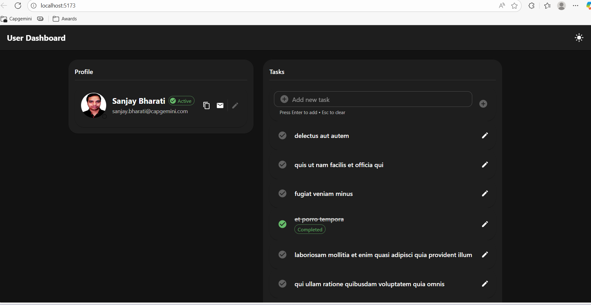
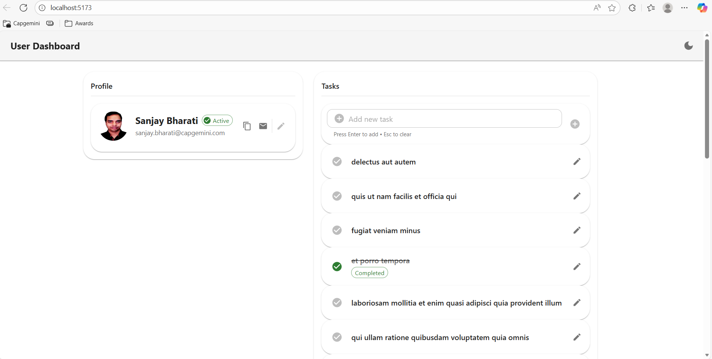
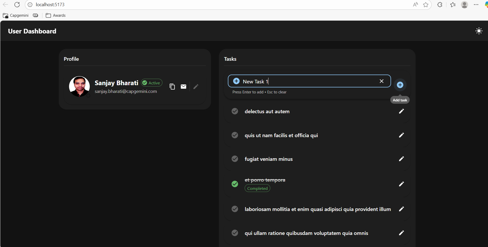
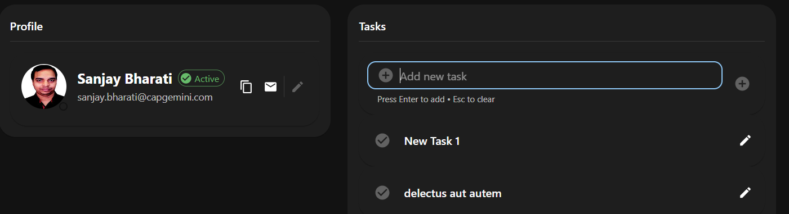
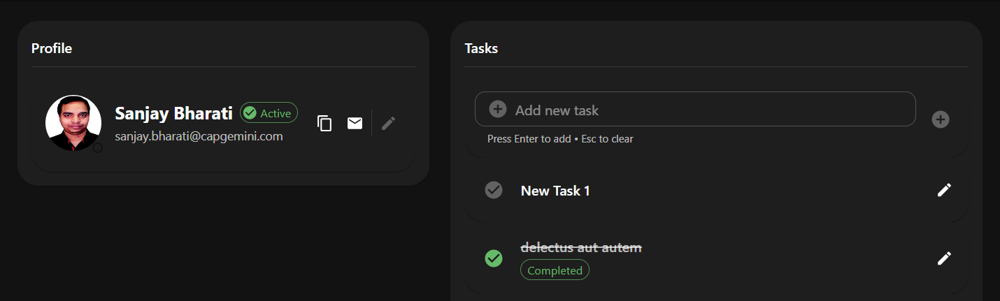
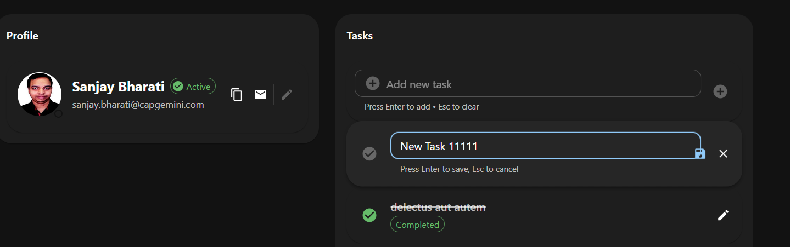
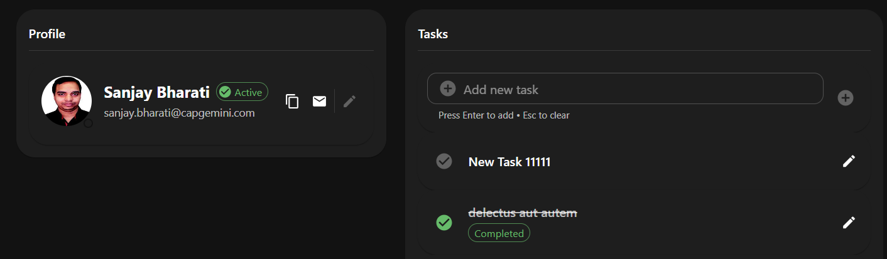
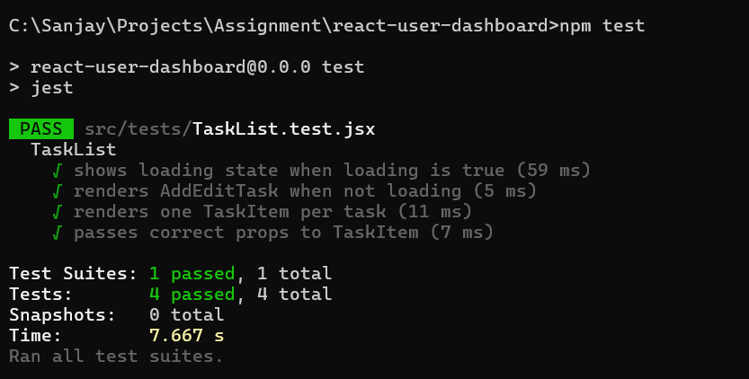

# React Assignment - MUI Integration

## Tech Stack
- React
- Material UI (MUI)
- Vite

## Setup Instructions
1. npm install
2. npm run dev

## Project Structure

react-user-dashboard/
|--- src/
|    |--- assets/         # Static assets
|    |--- components/     # Reusable UI
|    |     |--- AddEditTask.jsx
|    |     |--- ProfileCard.jsx
|    |     |--- TaskItem.jsx
|    |     |--- TaskList.jsx
|    |
|    |--- context/        # React Context for state management
|    |    |--- TaskContext.jsx
|    |
|    |--- services/       # API / service layer
|    |    |--- taskService.js
|    |
|    |--- tests/          # Unit tests
|    |    |--- TaskList.test.jsx
|    |
|    |--- App.jsx         # Root component
|    |--- App.css
|    |--- index.css
|    |--- main.jsx        # Application entry point
|    |--- setupTests.js   # Jest setup
|    |--- theme.js        # MUI theme configuration
|    |
|--- .gitignore
|--- babel.config.js
|--- index.html
|--- jest.config.js
|--- package.json
|--- package-lock.json
|--- vite.config.js
|--- README.md

## Features
- Profile Card: Hardcode sample user data (name, email, photo URL) - Utilities to copy email address or mail directly.
- Task List: 
    - Lists all tasks fetched from a REST API (GET https://jsonplaceholder.typicode.com/todos?userId=1)
    - A new task can be added (Restricted to add a title atleast of 3 characters)
    - Existing task names can be edited.
    - Tasks can be toggled to completed with green tick or incomplete with grey tick.
- Responsive design
- Keyboard navigation is added wherever possible.
- Jest test cases

## Screenshots
### Dashboard Dark mode

### Dashboard Light mode

### Adding New Task

### New Task added

### Task Toggled to Completed

### Editing Task

### Task Editted

### Test cases Passed

## Notes
Assignment submission for evaluation